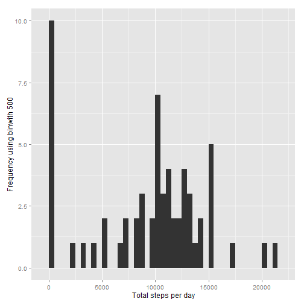
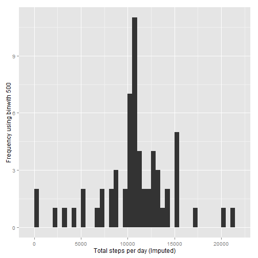
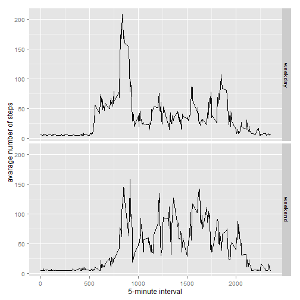

# Reproducible Research: Peer Assessment 1


```r
#---------------------------------------------
#title: "PA1_template.Rmd"
#author: "Prabir Maiti"
#date: "Sunday, October 18, 2015"
#output: PA1_template.md and PA1_template.html
#---------------------------------------------
```


## Loading and preprocessing the data
##### 1. Load the data (i.e. read.csv())


```r
## setwd("C:\DataScience\5-ReproducibleResearch\WorkingDirectory")
workingDirectory<-getwd()
        
## Base Folder Name
baseDataFolder <- 'Activity_Data'

## download all data files and unzip those
if (!file.exists(baseDataFolder)) {
        dir.create(file.path(workingDirectory, baseDataFolder), showWarnings = FALSE)

	fileUrl <- 'https://d396qusza40orc.cloudfront.net/repdata%2Fdata%2Factivity.zip'
	zipFile = paste(workingDirectory, "/", baseDataFolder, "/activity.zip", sep="")
	extractDir = paste(workingDirectory, "/", baseDataFolder,sep="")
	setInternet2(TRUE)
	download.file(fileUrl, destfile = zipFile)
	unzip(zipfile = zipFile, overwrite = TRUE, exdir = extractDir)
}

## create file paths for activity
filePathActivity <- paste(workingDirectory, "/", baseDataFolder, "/activity.csv", sep="")

activityData <- read.csv('activity.csv')

head(activityData)
```

```
##   steps       date interval
## 1    NA 2012-10-01        0
## 2    NA 2012-10-01        5
## 3    NA 2012-10-01       10
## 4    NA 2012-10-01       15
## 5    NA 2012-10-01       20
## 6    NA 2012-10-01       25
```

##### 2. Process/transform the data (if necessary) into a format suitable for your analysis

```r
#activityData$interval <- strptime(gsub("([0-9]{1,2})([0-9]{2})", "\\1:\\2", activityData$interval), format='%H:%M')
```

-----

## What is mean total number of steps taken per day?

```r
stepsByDay <- tapply(activityData$steps, activityData$date, sum, na.rm=TRUE)
```

##### 1. Make a histogram of the total number of steps taken each day

```r
qplot(stepsByDay, xlab='Total steps per day', ylab='Frequency using binwith 500', binwidth=500)
```

 

##### 2. Calculate and report the mean and median total number of steps taken per day

```r
stepsByDayMean <- mean(stepsByDay)
stepsByDayMedian <- median(stepsByDay)
```
* Mean: 9354.2295082
* Median:  10395

-----

## What is the average daily activity pattern?

```r
averageStepsPerTimeBlock <- aggregate(x=list(meanSteps=activityData$steps), by=list(interval=activityData$interval), FUN=mean, na.rm=TRUE)
```

##### 1. Make a time series plot

```r
ggplot(data=averageStepsPerTimeBlock, aes(x=interval, y=meanSteps)) +
        geom_line() +
        xlab("5-minute interval") +
        ylab("average number of steps taken") 
```

 

##### 2. Which 5-minute interval, on average across all the days in the dataset, contains the maximum number of steps?

```r
mostSteps <- which.max(averageStepsPerTimeBlock$meanSteps)
timeMostSteps <-  gsub("([0-9]{1,2})([0-9]{2})", "\\1:\\2", averageStepsPerTimeBlock[mostSteps,'interval'])
```

* Most Steps at: 8:35

----

## Imputing missing values
##### 1. Calculate and report the total number of missing values in the dataset 

```r
numMissingValues <- length(which(is.na(activityData$steps)))
```

* Number of missing values: 2304

##### 2. Devise a strategy for filling in all of the missing values in the dataset.
##### 3. Create a new dataset that is equal to the original dataset but with the missing data filled in.

```r
activityDataImputed <- activityData
activityDataImputed$steps <- impute(activityData$steps, fun=mean)
```


##### 4. Make a histogram of the total number of steps taken each day 

```r
stepsByDayImputed <- tapply(activityDataImputed$steps, activityDataImputed$date, sum)
qplot(stepsByDayImputed, xlab='Total steps per day (Imputed)', ylab='Frequency using binwith 500', binwidth=500)
```

 

##### ... and Calculate and report the mean and median total number of steps taken per day. 

```r
stepsByDayMeanImputed <- mean(stepsByDayImputed)
stepsByDayMedianImputed <- median(stepsByDayImputed)
```
* Mean (Imputed): 1.0766189 &times; 10<sup>4</sup>
* Median (Imputed):  1.0766189 &times; 10<sup>4</sup>


----

## Are there differences in activity patterns between weekdays and weekends?
##### 1. Create a new factor variable in the dataset with two levels ??? ???weekday??? and ???weekend??? indicating whether a given date is a weekday or weekend day.


```r
activityDataImputed$dateType <-  ifelse(as.POSIXlt(activityDataImputed$date)$wday %in% c(0,6), 'weekend', 'weekday')
```

##### 2. Make a panel plot containing a time series plot


```r
averagedActivityDataImputed <- aggregate(steps ~ interval + dateType, data=activityDataImputed, mean)
ggplot(averagedActivityDataImputed, aes(interval, steps)) + 
        geom_line() + 
        facet_grid(dateType ~ .) +
        xlab("5-minute interval") + 
        ylab("avarage number of steps")
```

 

